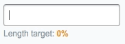

# Text Target Length for SilverStripe CMS



If you see a field marked 'Description' you know roughly what type of content to put in there. But how do you know how much of it to write? A single sentence might do, but maybe a paragraph or more is required? A great content plan should recommend an ideal length for every type of content, so content authors and designers alike can make informed decisions.

This module extends the `TextField` and `TextareaField` classes in SilverStripe to allow you to set a recommended content length, and set soft upper and lower limits on character count.

## Requirements

SilverStripe 3.1+ (3.3 tested)

## Installation

### Composer (best practice)

[Packagist listing](https://packagist.org/packages/jonom/silverstripe-text-target-length) and [installation instructions](http://doc.silverstripe.org/framework/en/trunk/installation/composer#adding-modules-to-your-project)

### Manually

I promise it's worth your time to learn how to use Composer. If painless updating isn't your thing though you can download and extract this project, rename the module folder 'text-target-length', place it in your project root and run a dev/build?flush=1.

## How to use

With the module installed you can call call `setTargetLength()` on `TextField` and `TextareaField` form fields.

```php
// Ideal length: 100 characters
// Minimum: 75 (automatically set at 75% of ideal)
// Maximum: 125 (automatically set at 125% of ideal)
$field->setTargetLength(100);

// Ideal length: 100 characters
// Minimum: 25
// Maximum: 150
$field->setTargetLength(100, 25, 150);
```

## Want to see more like this?

I donate a lot of my time to open-source projects, so if you use this module in a commercial project a small donation to keep me motivated would be much appreciated. If you'd like to sponsor additional development on this module I'd love to hear from you.

[](https://www.paypal.com/cgi-bin/webscr?cmd=_s-xclick&hosted_button_id=Z5HEZREZSKA6A)

## To Do

 - [ ] Extension for HTMLEditorField?
 - [ ] Translation
 - [ ] Customise hint text through config

## Maintainer contact

[jonathonmenz.com](http://jonathonmenz.com)
